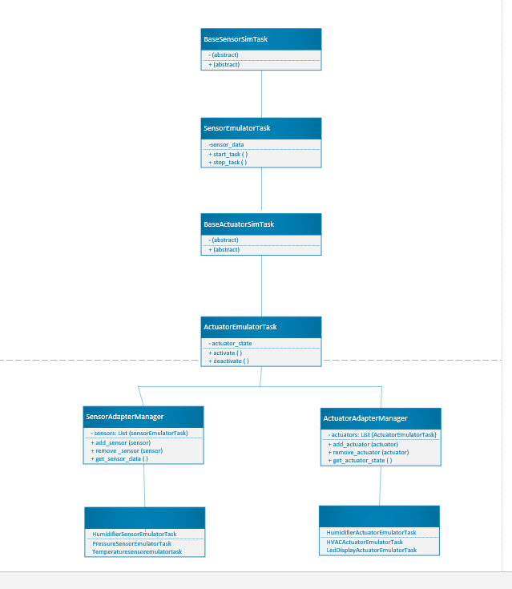

# Constrained Device Application (Connected Devices)

## Lab Module 04

Be sure to implement all the PIOT-CDA-* issues (requirements) listed at [PIOT-INF-04-001 - Lab Module 04](https://github.com/orgs/programming-the-iot/projects/1#column-10488386).

### Description

NOTE: Include two full paragraphs describing your implementation approach by answering the questions listed below.

What does your implementation do? 

The implementation centers on creating Python modules that simulate sensor and actuator functionality, with a focus on integrating SenseHAT emulator capabilities. These modules are built by extending the abstract classes BaseSensorSimTask and BaseActuatorSimTask, allowing the new sensor and actuator emulator tasks to closely replicate their real-world equivalents. This setup provides a robust environment for testing and development. Each emulator task class is designed to handle specific attributes and methods related to sensor data collection and actuator state control. The SensorAdapterManager and ActuatorAdapterManager classes manage these emulators dynamically, enabling efficient coordination of sensor and actuator instances, and facilitating their integration into a broader IoT system.

How does your implementation work?

The implementation leverages the Pisense and Sense-Emu libraries, which provide core functionality for emulating sensors and actuators. The SensorAdapterManager and ActuatorAdapterManager are designed with methods to add, remove, and manage sensors and actuators, as well as retrieve their current data or states. These emulator tasks simulate real-time data collection and control, enabling application testing in a controlled environment. The design emphasizes modularity and extensibility, allowing for easy updates or integration of additional emulators as needed. Unit and integration tests are structured to validate the behavior of each module, ensuring they meet the requirements outlined in the PIOT-CDA-* issues.

### Code Repository and Branch

NOTE: Be sure to include the branch (e.g. https://github.com/programming-the-iot/python-components/tree/alpha001).

URL: Elikem161/py-components at lab04 (github.com)

### UML Design Diagram(s)

NOTE: Include one or more UML designs representing your solution. It's expected each
diagram you provide will look similar to, but not the same as, its counterpart in the
book [Programming the IoT](https://learning.oreilly.com/library/view/programming-the-internet/9781492081401/).
 
 

### Unit Tests Executed

NOTE: TA's will execute your unit tests. You only need to list each test case below
(e.g. ConfigUtilTest, DataUtilTest, etc). Be sure to include all previous tests, too,
since you need to ensure you haven't introduced regressions.

 - SensorEmulatorTaskTest
 - ActuatorEmulatorTaskTest
 - SensorAdapterManagerTest
 - ActuatorAdapterManagerTest
 - BaseSensorSimTaskTest
 - BaseActuatorSimTaskTest

### Integration Tests Executed

NOTE: TA's will execute most of your integration tests using their own environment, with
some exceptions (such as your cloud connectivity tests). In such cases, they'll review
your code to ensure it's correct. As for the tests you execute, you only need to list each
test case below (e.g. SensorSimAdapterManagerTest, DeviceDataManagerTest, etc.)

    - SensorIntegrationTest
    - ActuatorIntegrationTest
    - SensorAdapterManagerIntegrationTest
    - ActuatorAdapterManagerIntegrationTest
    - SystemIntegrationTest

EOF.
