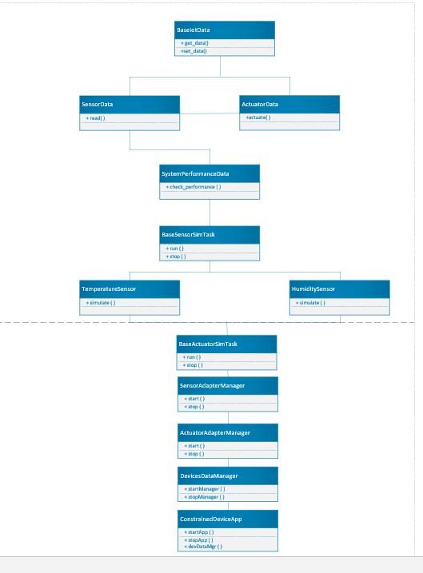

# Constrained Device Application (Connected Devices)

## Lab Module 03

Be sure to implement all the PIOT-CDA-* issues (requirements) listed at [PIOT-INF-03-001 - Lab Module 03](https://github.com/orgs/programming-the-iot/projects/1#column-10488379).

### Description

NOTE: Include two full paragraphs describing your implementation approach by answering the questions listed below.

What does your implementation do?
The implementation focuses on developing and refining multiple Python modules to represent sensor and actuator data, simulation tasks, and data management within the Constrained Device Application (CDA). It includes the creation of data classes such as SensorData, ActuatorData, and SystemPerformanceData, all inheriting from a base class called BaseIotData. These classes feature attributes for float values representing sensor readings and state data for actuator commands. The ActuatorData class, in particular, includes a command variable to manage actuation and a value variable to store the numeric data.
Additionally, sensor simulation tasks such as HumiditySensorSimTask, PressureSensorSimTask, and TemperatureSensorSimTask are developed by extending BaseSensorSimTask to generate telemetry data. Similarly, actuator simulation tasks like HumidifierActuatorSimTask and HvacActuatorSimTask are derived from BaseActuatorSimTask and respond to commands from the ActuatorAdapterManager. The overall architecture is organized around a class hierarchy that enables communication through the DeviceDataManager, which serves as the core of the CDA. Each module has clear responsibilities: simulation tasks generate telemetry data for the DeviceDataManager, and the adapter managers handle interactions between the simulated sensors and actuators. The UML diagram effectively captures these relationships, emphasizing the class hierarchy and key methods critical for data management and operation simulation.
 

How does your implementation work?

In CDA 02, I worked on modifying the BaseSensorSimTask as instructed by the Candan board. After making the necessary changes, the class remained functional and didn't break. However, there are no specific tests to run for this part.
In CDA 04, I made updates to the BaseActuatorSimTask based on the given requirements. Once the modifications were complete, this class could be instantiated and used as a foundation for various types of actuators in my IoT project. I can further extend or override methods in subclasses to implement actuator-specific functionality as needed. Like in CDA 02, there are no tests to run for this part.
In CDA 006, I implemented the SensorAdapterManager, which centrally manages multiple sensor simulators or emulators. It provides a unified interface for starting, stopping, and retrieving telemetry data. By using configuration parameters, it determines whether to use simulators or emulators, sets up periodic data collection via APScheduler, and forwards collected data to a listener for further processing. This design simplifies testing, allows for flexible configurations, and provides a scalable solution for managing complex multi-sensor environments.
In CDA 007, the ActuatorAdapterManager class plays a key role in managing and controlling environmental actuators in an IoT application. It ensures real-time interaction, supports flexible development, and enables reliable monitoring, making it an essential part of maintaining optimal conditions in constrained device environments.
In CDA 008, the DeviceDataManager class is critical for handling interactions within a constrained device application. It's a central component in managing sensor data and actuator commands, making it essential for developing robust IoT projects that manage resources effectively and respond to real-time conditions.
In CDA 009, the ConstrainedDeviceApp acts as the control center for managing device data within an IoT environment. It ensures that data is processed correctly and monitors system performance, making it a crucial part of the efficient operation of IoT systems.

### Code Repository and Branch

NOTE: Be sure to include the branch (e.g. https://github.com/programming-the-iot/python-components/tree/alpha001).

URL: Elikem161/py-components (github.com)

### UML Design Diagram(s)

NOTE: Include one or more UML designs representing your solution. It's expected each
diagram you provide will look similar to, but not the same as, its counterpart in the
book [Programming the IoT](https://learning.oreilly.com/library/view/programming-the-internet/9781492081401/).

 

### Unit Tests Executed

NOTE: TA's will execute your unit tests. You only need to list each test case below
(e.g. ConfigUtilTest, DataUtilTest, etc). Be sure to include all previous tests, too,
since you need to ensure you haven't introduced regressions.

- ?  ActuatorDataTest: Ensures the ActuatorData class handles actuator commands and states correctly.
?  SensorDataTest: Validates the SensorData class for accurate data initialization and handling.
?  SystemPerformanceDataTest: Evaluates whether the SystemPerformanceData class accurately records performance metrics.
?  HumiditySensorSimTaskTest: Confirms that the HumiditySensorSimTask generates accurate humidity telemetry data.
?  PressureSensorSimTaskTest: Verifies the PressureSensorSimTask for correct pressure data simulation.
?  TemperatureSensorSimTaskTest: Checks if the TemperatureSensorSimTask produces valid temperature readings.
?  HumidifierActuatorSimTaskTest: Assesses whether the HumidifierActuatorSimTask handles commands and actuation properly.
?  HvacActuatorSimTaskTest: Validates the HvacActuatorSimTask response to HVAC control commands.
?  SensorAdapterManagerTest: Ensures the SensorAdapterManager effectively manages sensor data and simulation tasks.
?  ActuatorAdapterManagerTest: Tests the ActuatorAdapterManager for correct management and execution of actuator commands.

### Integration Tests Executed

NOTE: TA's will execute most of your integration tests using their own environment, with
some exceptions (such as your cloud connectivity tests). In such cases, they'll review
your code to ensure it's correct. As for the tests you execute, you only need to list each
test case below (e.g. SensorSimAdapterManagerTest, DeviceDataManagerTest, etc.)

- ?  DeviceDataManagerNoCommsTest: Evaluates the DeviceDataManager's capability to process data without relying on communication components.
?  ConstrainedDeviceAppTest: Tests the overall functionality of the ConstrainedDeviceApp, ensuring proper startup, shutdown, and device data management.
 

EOF.
