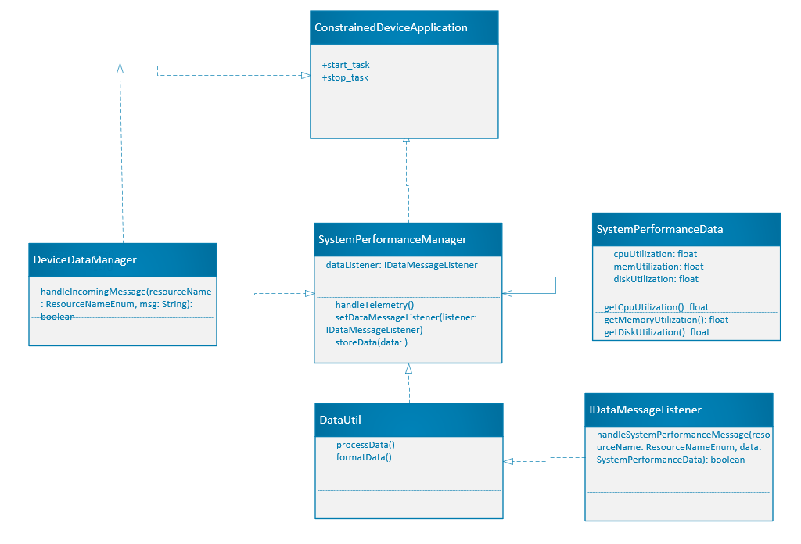

# Constrained Device Application (Connected Devices)

## Lab Module 05

Be sure to implement all the PIOT-CDA-* issues (requirements) listed at [PIOT-INF-05-001 - Lab Module 05](https://github.com/orgs/programming-the-iot/projects/1#column-10488421).

### Description

NOTE: Include two full paragraphs describing your implementation approach by answering the questions listed below.

What does your implementation do? 

The implementation enhances the existing system by creating and managing performance data through the SystemPerformanceManager class. It collects system telemetry data (such as CPU and memory utilization) using the handleTelemetry() method and stores this information in a SystemPerformanceData instance. Additionally, it invokes callback methods from an IDataMessageListener interface to ensure that any new data collected is processed correctly and made available to other components of the application. This allows for seamless communication and monitoring of system performance, which is crucial for IoT applications.

How does your implementation work?

The implementation leverages a modular approach, where data management and performance monitoring functionalities are separated into different classes. The SystemPerformanceManager class is responsible for gathering system telemetry data and storing it in SystemPerformanceData. When new data is collected, it checks if an IDataMessageListener instance is set and invokes the appropriate method to handle this data. The DataUtil class provides utility functions for data processing and conversion, ensuring that the data is prepared for any necessary transformations or validations. The entire system is designed to be extensible, allowing for easy integration of new sensors or actuators in the future.

### Code Repository and Branch

NOTE: Be sure to include the branch (e.g. https://github.com/programming-the-iot/python-components/tree/alpha001).

URL: https://github.com/Elikem161/py-components/tree/lab05

### UML Design Diagram(s)

NOTE: Include one or more UML designs representing your solution. It's expected each
diagram you provide will look similar to, but not the same as, its counterpart in the
book [Programming the IoT](https://learning.oreilly.com/library/view/programming-the-internet/9781492081401/).

### Unit Tests Executed

NOTE: TA's will execute your unit tests. You only need to list each test case below
(e.g. ConfigUtilTest, DataUtilTest, etc). Be sure to include all previous tests, too,
since you need to ensure you haven't introduced regressions.

  - ConfigUtilTest
  - DataUtilTest
  - SystemPerformanceManagerTest
  - SystemPerformanceDataTest
  - DeviceDataManagerTest

### Integration Tests Executed

NOTE: TA's will execute most of your integration tests using their own environment, with
some exceptions (such as your cloud connectivity tests). In such cases, they'll review
your code to ensure it's correct. As for the tests you execute, you only need to list each
test case below (e.g. SensorSimAdapterManagerTest, DeviceDataManagerTest, etc.)

   - SensorSimAdapterManagerTest
   - DeviceDataManagerTest
   - CloudClientConnectorTest
   - CoapServerGatewayTest

EOF.
