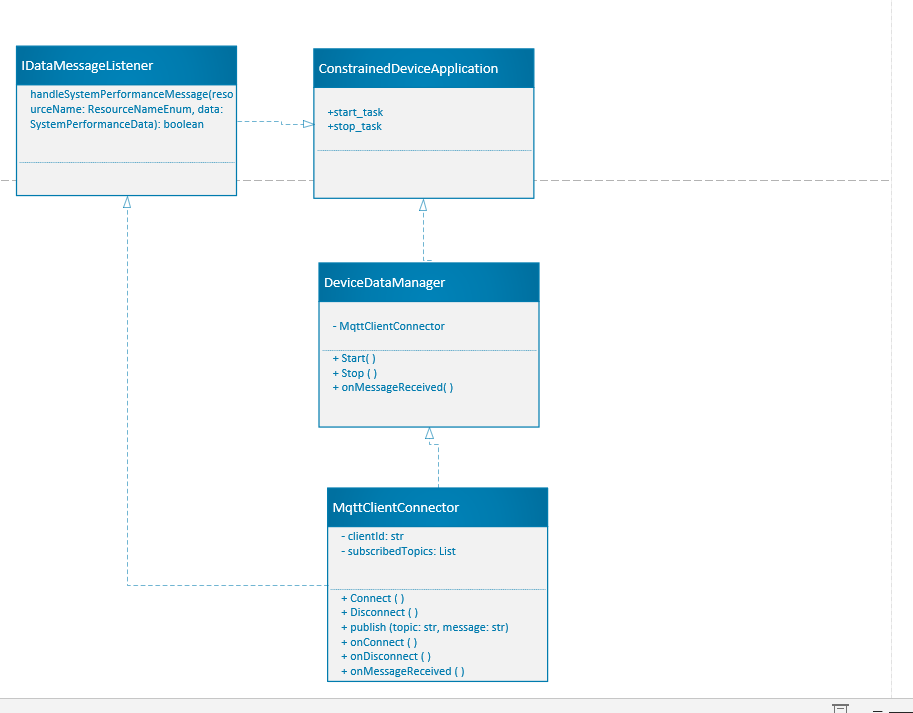

# Constrained Device Application (Connected Devices)

## Lab Module 06

Be sure to implement all the PIOT-CDA-* issues (requirements) listed at [PIOT-INF-06-001 - Lab Module 06](https://github.com/orgs/programming-the-iot/projects/1#column-10488434).

### Description

NOTE: Include two full paragraphs describing your implementation approach by answering the questions listed below.

What does your implementation do? 

The MqttClientConnector class implements an MQTT client using the IPubSubClient interface. It provides functionalities to:
    Connect to an MQTT broker.
    Disconnect from the MQTT broker.
    Publish messages to specific topics.
    Subscribe to topics and handle incoming messages.
    Manage MQTT client events such as connection, disconnection, and message reception.

    Through the integration of this class into the DeviceDataManager,
     the application may sustain a live connection to the MQTT broker during its operation, 
     hence enabling real-time data exchange and communication.

How does your implementation work?

Class Definition: The MqttClientConnector class is defined with methods to handle connections, disconnections, publishing, and subscribing to topics.

Event Callbacks: The class implements event callbacks for MQTT events:
        onConnect: Triggered when the client successfully connects to the broker.
        onDisconnect: Triggered when the client disconnects from the broker.
        onMessageReceived: Triggered when a message is received on a subscribed topic.

Integration with DeviceDataManager:
        The DeviceDataManager initializes the MqttClientConnector instance.
        In the start() method, it calls the connect() method of MqttClientConnector to establish a connection with the MQTT broker.
        In the stop() method, it calls the disconnect() method to terminate the connection.

Publish/Subscribe: The MqttClientConnector can publish messages to specific topics using the publish() method and subscribe to topics using the subscribe() method, 
allowing it to send and receive messages effectively.

### Code Repository and Branch

NOTE: Be sure to include the branch (e.g. https://github.com/programming-the-iot/python-components/tree/alpha001).

URL: https://github.com/Elikem161/py-components/tree/lab06

### UML Design Diagram(s)

NOTE: Include one or more UML designs representing your solution. It's expected each
diagram you provide will look similar to, but not the same as, its counterpart in the
book [Programming the IoT](https://learning.oreilly.com/library/view/programming-the-internet/9781492081401/).

### Unit Tests Executed

NOTE: TA's will execute your unit tests. You only need to list each test case below
(e.g. ConfigUtilTest, DataUtilTest, etc). Be sure to include all previous tests, too,
since you need to ensure you haven't introduced regressions.

- MqttClientConnectorTest
- ActuatorDataTest
- SystemPerformanceData

### Integration Tests Executed

NOTE: TA's will execute most of your integration tests using their own environment, with
some exceptions (such as your cloud connectivity tests). In such cases, they'll review
your code to ensure it's correct. As for the tests you execute, you only need to list each
test case below (e.g. SensorSimAdapterManagerTest, DeviceDataManagerTest, etc.)

- CDA
- DeviceDataManagerNoCommsTest
- ActuatorAdapterManagerTest

EOF.
