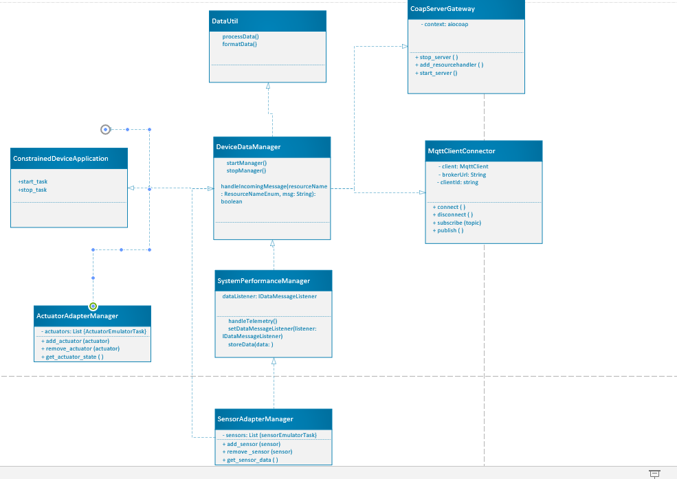

# Constrained Device Application (Connected Devices)

## Lab Module 08

Be sure to implement all the PIOT-CDA-* issues (requirements) listed at [PIOT-INF-08-001 - Lab Module 08](https://github.com/orgs/programming-the-iot/projects/1#column-10488501).

### Description

NOTE: Include two full paragraphs describing your implementation approach by answering the questions listed below.

What does your implementation do? 

Through the establishment of a CoAP server (CoapServerAdapter) with several resource endpoints, 
this solution enables remote access to data from IoT devices. When data changes,
 observers are alerted by the SystemPerformanceData and SensorData resources it hosts. 
 Furthermore, it offers a PUT request endpoint for actuation commands, 
 which are then processed by the server to activate actuators.

How does your implementation work?

Each endpoint's resource handlers are registered and the server is initialized by the CoapServerAdapter. 
Every handler processes CoAP requests in a different way (e.g., PUT for actuator control, 
GET for system data and telemetry). 
Clients watching the resources can receive real-time updates thanks to the handler classes, 
which record requests, respond to them, and notify users when data changes.

### Code Repository and Branch

NOTE: Be sure to include the branch (e.g. https://github.com/programming-the-iot/python-components/tree/alpha001).

URL: https://github.com/Elikem161/py-components/tree/lab08

### UML Design Diagram(s)

NOTE: Include one or more UML designs representing your solution. It's expected each
diagram you provide will look similar to, but not the same as, its counterpart in the
book [Programming the IoT](https://learning.oreilly.com/library/view/programming-the-internet/9781492081401/).

### Unit Tests Executed

NOTE: TA's will execute your unit tests. You only need to list each test case below
(e.g. ConfigUtilTest, DataUtilTest, etc). Be sure to include all previous tests, too,
since you need to ensure you haven't introduced regressions.

- CoapServerAdapterTest: Examines resource registration, server startup, and the fundamentals of managing CoAP requests.
- DeviceDataManagerTest: Confirms that DeviceDataManager can handle data and manage resources.
- ConfigUtilTest: Verifies that ConfigUtil is used to load and access configurations.

### Integration Tests Executed

NOTE: TA's will execute most of your integration tests using their own environment, with
some exceptions (such as your cloud connectivity tests). In such cases, they'll review
your code to ensure it's correct. As for the tests you execute, you only need to list each
test case below (e.g. SensorSimAdapterManagerTest, DeviceDataManagerTest, etc.)

- CoapClientToServerConnectorTest: Verifies client-server communication using CoAP protocols.
- SensorDataObserverTest: Verifies the functioning of observer patterns for updates to sensor data.
- SystemPerformanceDataObserverTest: Examines alerting systems for modifications in system performance data.

EOF.
