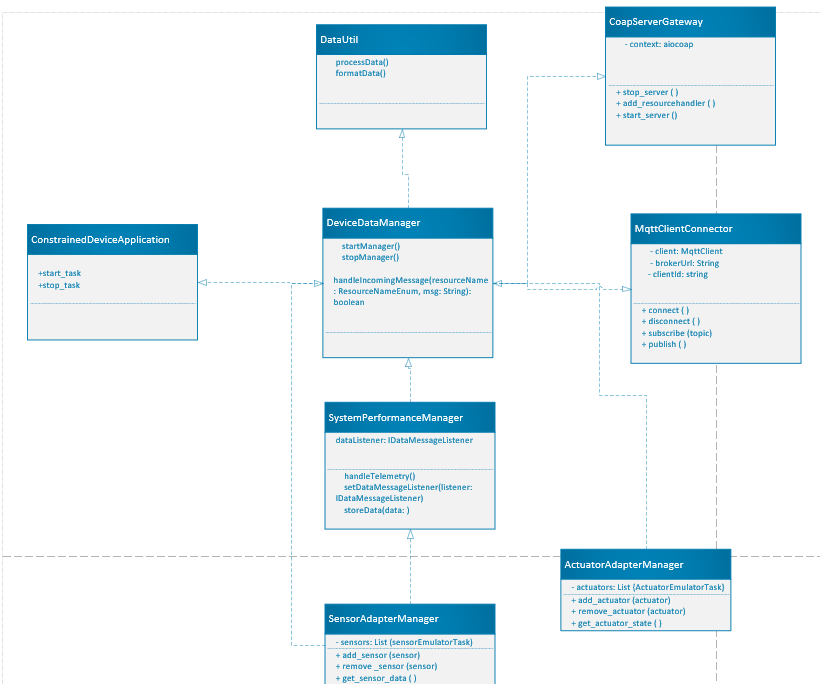

# Constrained Device Application (Connected Devices)

## Lab Module 09

Be sure to implement all the PIOT-CDA-* issues (requirements) listed at [PIOT-INF-09-001 - Lab Module 09](https://github.com/orgs/programming-the-iot/projects/1#column-10488503).

### Description

NOTE: Include two full paragraphs describing your implementation approach by answering the questions listed below.

What does your implementation do? 

In an Internet of Things setting, the CoapClientConnector module is made to manage communication between a server and a CoAP (Constrained Application Protocol) client. 
It is designed to manage several kinds of CoAP requests, including GET, PUT, POST, DELETE, and OBSERVE, and it implements the IRequestResponse interface. 
Depending on which library is selected, this module utilizes either aiocoap or CoAPthon3 to support these requests.

How does your implementation work?

 CoapClientConnector Class:

The IRequestResponse interface, which was probably created to standardize the handling of requests and responses, is followed by this class. 
To transmit and receive requests over the CoAP protocol, it makes use of one of the two CoAP libraries (CoAPthon3 or aiocoap). 
Depending on the library used, the implementation will differ, but it will typically manage the fundamental request-response flow.

GET Requests:

To obtain data, the CoapClientConnector class makes a GET request to a CoAP server. 
It manages the server's response, which may contain an error or the requested data. 
To appropriately handle the GET request type, the implementation adheres to the current method definitions within IRequestResponseHandler.

PUT Inquiries:

To update or change data on a CoAP server, the class will submit a PUT request. 
To correctly integrate PUT request processing with CoAP communication, 
it will make use of the IRequestResponseHandler.

POST Inquiries:

POST requests are used to send fresh data to a CoAP server, just as PUT requests. 
As specified by the IRequestResponseHandler interface, the CoapClientConnector will generate the POST request and manage the server's response, 
including managing success or failure.

Delete Requests:

To remove or delete data from the CoAP server, DELETE requests are made. 
Using the appropriate function from IRequestResponseHandler, 
the class will send the DELETE request and respond to the server's answer appropriately.

Observe Requests:

With the help of the unique CoAP request OBSERVE, the client may sign up for resource notifications and get updates whenever the resource changes.
 In order to handle the constant stream of changes from the CoAP server, the CoapClientConnector will be modified to allow OBSERVE requests. 
 This entails establishing the required subscription in order to view the resource.

Connecting DeviceDataManager:

The DeviceDataManager, to which the CoapClientConnector class is attached, most likely serves as the main hub for handling data from different IoT devices. 
Interactions with CoAP-based resources will be managed by the CoapClientConnector, 
and the DeviceDataManager will use the outcomes of those interactions to handle and process data throughout the system.

### Code Repository and Branch

NOTE: Be sure to include the branch (e.g. https://github.com/programming-the-iot/python-components/tree/alpha001).

URL: https://github.com/Elikem161/py-components/tree/lab09

### UML Design Diagram(s)

NOTE: Include one or more UML designs representing your solution. It's expected each
diagram you provide will look similar to, but not the same as, its counterpart in the
book [Programming the IoT](https://learning.oreilly.com/library/view/programming-the-internet/9781492081401/).

### Unit Tests Executed

NOTE: TA's will execute your unit tests. You only need to list each test case below
(e.g. ConfigUtilTest, DataUtilTest, etc). Be sure to include all previous tests, too,
since you need to ensure you haven't introduced regressions.

- CoapServerAdapterTest: Investigates server initialization, resource registration, and the principles of handling CoAP requests.
- DeviceDataManagerTest: Verifies that DeviceDataManager is capable of managing resources and handling data.
- ConfigUtilTest: Confirms that configurations are loaded and accessed using ConfigUtil.

### Integration Tests Executed

NOTE: TA's will execute most of your integration tests using their own environment, with
some exceptions (such as your cloud connectivity tests). In such cases, they'll review
your code to ensure it's correct. As for the tests you execute, you only need to list each
test case below (e.g. SensorSimAdapterManagerTest, DeviceDataManagerTest, etc.)

- SystemPerformanceDataObserverTest: Examines alerting systems for modifications in system performance data.
- CoapClientConnectorTest CoapClientToServerConnectorTest: Verifies client-server communication using CoAP protocols.
-  SensorDataObserverTest: Verifies the functioning of observer patterns for updates to sensor data.

EOF.
