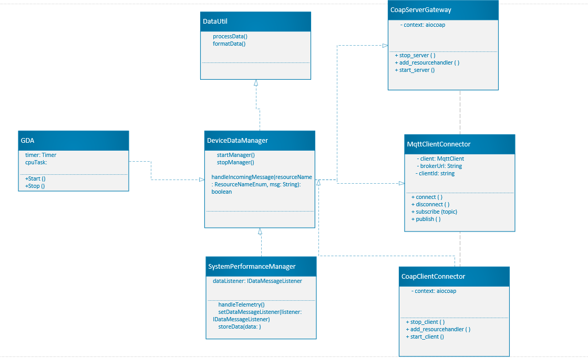

# Constrained Device Application (Connected Devices)

## Lab Module 09

Be sure to implement all the PIOT-CDA-* issues (requirements) listed at [PIOT-INF-09-001 - Lab Module 09](https://github.com/orgs/programming-the-iot/projects/1#column-10488503).

### Description

NOTE: Include two full paragraphs describing your implementation approach by answering the questions listed below.

What does your implementation do? 
An IoT environment's CoAP (Constrained Application Protocol) client and server can communicate more easily thanks to the CoapClientConnector class, a Java implementation. In addition to providing functionality for many kinds of CoAP queries, including GET, PUT, POST, DELETE, and device discovery, this class implements the IRequestResponse interface. Furthermore, a GenericCoapResponseHandler class is developed to manage responses, processing the server's responses by implementing the CoapHandler interface.

How does your implementation work?

CoapClientConnector Class: The IRequestResponse interface, which offers a standardized method of handling requests and responses, is implemented by this class. Using a suitable CoAP library (such CoAPthon3 or aiocoap, as specified in the instructions) to connect with CoAP servers, the CoapClientConnector class will be in charge of starting and handling CoAP requests. The class will be modified to support the several sorts of CoAP requests (GET, PUT, POST, and DELETE) and will have features for network device discovery.

Discovery Functionality: CoapClientConnector will be upgraded to enable discovery functionality, allowing it to find servers or other CoAP resources on the network. For Internet of Things applications, where servers or devices may join or exit the network dynamically, this is essential. The client can find available devices or services in the network by implementing device discovery via CoAP multicast or other CoAP-specific discovery protocols.

GET Requests: The class will use IRequestResponseHandler's current method definitions to handle GET requests. Resources are retrieved from a CoAP server using a GET request. The selected CoAP library will be used by the CoapClientConnector to send a GET request and manage the server's response. The GenericCoapResponseHandler will be used to process the response.

PUT Requests: The CoAP server's existing resources can be updated or modified via PUT requests. The CoapClientConnector will utilize the IRequestResponseHandler interface to process the response after sending a PUT request to the server. By adding new data to the server or altering an already-existing resource, the PUT technique will be put into practice.

POST Requests: To add new resources to a CoAP server or send data for processing, POST requests are utilized. The CoapClientConnector will use the IRequestResponseHandler interface to handle the response after sending a POST request. In situations where fresh configurations or data must be sent to a CoAP server, this feature is essential.

DELETE Requests: To delete data or resources from the CoAP server, utilize DELETE requests. The IRequestResponseHandler interface will be used to handle the response to the DELETE request sent by the CoapClientConnector class to the server. The resource or data will be deleted from the server as a result of the DELETE request, and the response will be handled appropriately.

GenericCoapResponseHandler Class: Processing answers from the CoAP server is the responsibility of the GenericCoapResponseHandler, which implements the CoapHandler interface. The handler will specify how to handle various response kinds, including timeout, error, and success. The CoapClientConnector will handle the answers to GET, PUT, POST, DELETE, and discovery requests using this class.

### Code Repository and Branch

NOTE: Be sure to include the branch (e.g. https://github.com/programming-the-iot/python-components/tree/alpha001).

URL: https://github.com/Elikem161/java-components/tree/lab09

### UML Design Diagram(s)

NOTE: Include one or more UML designs representing your solution. It's expected each
diagram you provide will look similar to, but not the same as, its counterpart in the
book [Programming the IoT](https://learning.oreilly.com/library/view/programming-the-internet/9781492081401/).

### Unit Tests Executed

NOTE: TA's will execute your unit tests. You only need to list each test case below
(e.g. ConfigUtilTest, DataUtilTest, etc). Be sure to include all previous tests, too,
since you need to ensure you haven't introduced regressions.

- CoapServerAdapterTest: Verifies the functionality of the CoAP server adapter. 
- ConfigUtilTest: Verifies the functioning of configuration utilities. 
- DeviceDataManagerTest: Confirms procedures for managing device data.

### Integration Tests Executed

NOTE: TA's will execute most of your integration tests using their own environment, with
some exceptions (such as your cloud connectivity tests). In such cases, they'll review
your code to ensure it's correct. As for the tests you execute, you only need to list each
test case below (e.g. SensorSimAdapterManagerTest, DeviceDataManagerTest, etc.)

- DeviceDataManager
- GDA
- CoapClientConnectorTest

EOF.
