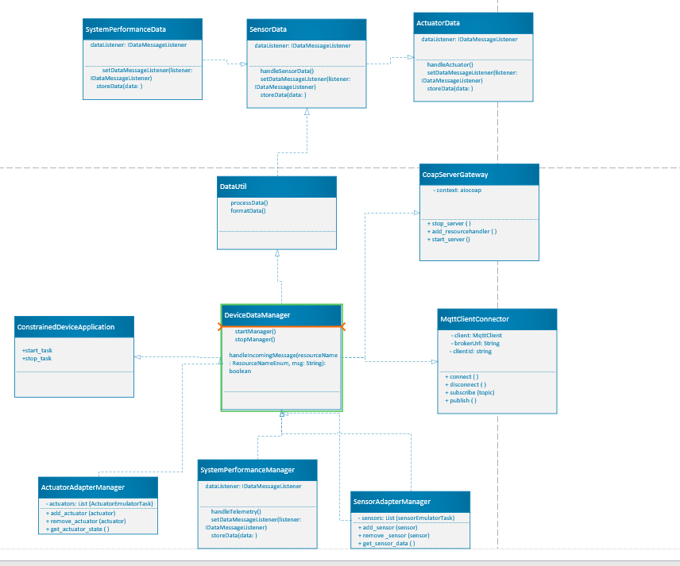

# Constrained Device Application (Connected Devices)

## Lab Module 10

Be sure to implement all the PIOT-CDA-* issues (requirements) listed at [PIOT-INF-10-001 - Lab Module 10](https://github.com/orgs/programming-the-iot/projects/1#column-10488510).

### Description

NOTE: Include two full paragraphs describing your implementation approach by answering the questions listed below.

What does your implementation do? 

Through the integration of many sensor and actuator emulators, the implementation concentrates on the CDA (Constrained Device Application) functionality. 
It offers a testing environment for these features independent of a physical GDA (Gateway Device Application) by enabling the simulation of real-world IoT device interactions, such as temperature, humidity, and HVAC management. 
The fundamental component for verifying data processing, actuator reactions, and system behavior under preset settings is the CDA.

How does your implementation work?

To set up and control simulated sensors and actuators, the CDA uses dynamic module loading.
 In order to facilitate effective communication between sensor data inputs and actuator command outputs, 
 it smoothly interacts with its Device Data Manager. Strong component interaction is ensured by the system's modular and flexible architecture.
The CDA is the sole focus of testing, which covers important topics like confirming that sensor data is transmitted to emulators, 
simulating actuator commands to confirm responses, making sure that sensor-actuator interactions are properly logged and processed, and carefully testing the CDA's persistence and data management features. 
This strategy guarantees the dependability and effectiveness of the CDA's primary functions.

### Code Repository and Branch

NOTE: Be sure to include the branch (e.g. https://github.com/programming-the-iot/python-components/tree/alpha001).

URL: https://github.com/Elikem161/py-components/tree/lab10

### UML Design Diagram(s)

NOTE: Include one or more UML designs representing your solution. It's expected each
diagram you provide will look similar to, but not the same as, its counterpart in the
book [Programming the IoT](https://learning.oreilly.com/library/view/programming-the-internet/9781492081401/).

### Unit Tests Executed

NOTE: TA's will execute your unit tests. You only need to list each test case below
(e.g. ConfigUtilTest, DataUtilTest, etc). Be sure to include all previous tests, too,
since you need to ensure you haven't introduced regressions.

- SensorData Tests: Verify that sensor data is created, stored, and retrieved correctly.

- ActuatorData Tests: Verify precise actuator handling and state transitions.

- DeviceDataManager Tests: Check the CDA's lifecycle management, event handling, and data flow.

- SystemPerformanceData Tests: Verify the gathering and processing of CPU and memory use statistics.

- RedisPersistenceAdapter Tests: Examine the functionality of data retrieval and persistence.

### Integration Tests Executed

NOTE: TA's will execute most of your integration tests using their own environment, with
some exceptions (such as your cloud connectivity tests). In such cases, they'll review
your code to ensure it's correct. As for the tests you execute, you only need to list each
test case below (e.g. SensorSimAdapterManagerTest, DeviceDataManagerTest, etc.)

- Sensor-Actuator Interaction: Use sensor input and actuator response validation to replicate real-world situations.

- CoapServerAdapter Tests: Verify the communication and data exchange capabilities of CoAP server endpoints.

-  MQTT Client-Server Interaction: Examine MQTT communications for actuator commands and sensor changes.

- Persistence Layer Integration: Make sure that data processing and persistence technologies are seamlessly integrated.

- Finish the CDA Lifecycle Test: Examine all aspects of functioning, including shutdown, data flow, and startup.

EOF.
