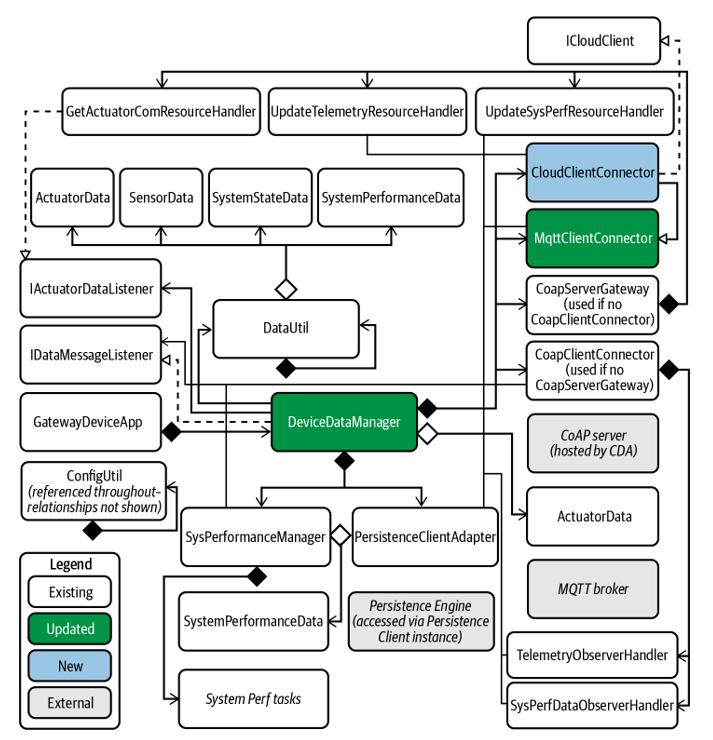

# Gateway Device Application (Connected Devices)

## Lab Module 11

Be sure to implement all the PIOT-GDA-* issues (requirements) listed at [PIOT-INF-11-001 - Lab Module 11](https://github.com/orgs/programming-the-iot/projects/1#column-10488514).

### Description

NOTE: Include two full paragraphs describing your implementation approach by answering the questions listed below.

What does your implementation do? 

To make cloud-based data processing easier, this solution expands on the already-existing MqttClientConnector and combines it with a recently created CloudClientConnector class. The approach facilitates smooth communication between a cloud service, the GDA (Gateway Device Application), and the CDA (Constrained Device Application). System performance and sensor data are published from the CDA to the GDA and then sent to the cloud, allowing bidirectional data flow. Incoming data may also be compared to predetermined thresholds by the cloud service, which can then give actuation commands—like turning on an LED—that the GDA evaluates and passes along to the CDA for implementation.

By enabling real-time data monitoring and automatic reactions to preset circumstances, this approach improves the scalability and intelligence of Internet of Things applications. The GDA guarantees effective data routing and command execution, while the cloud service serves as the focal point for data analysis and decision-making.

How does your implementation work?

Due to its robust and lightweight pub/sub communication, the solution makes use of the MQTT protocol. The ability of MqttClientConnector to handle MQTT activities, including publishing, subscribing, and unsubscribing, is encapsulated in CloudClientConnector. A specific part of the PiotConfig.props file is used to dynamically get the cloud connection configuration parameters.

From the CDA to the GDA and finally to the cloud, data moves with ease. Data on sensor and system performance is published to certain cloud topics. These data streams are analyzed by threshold rules set up in the cloud service, which then produce actuation events if certain conditions are satisfied. The GDA subscribes to a certain topic to which these events are published. After processing the commands, the GDA sends them to the CDA for actuation, such turning on or off LEDs. Additionally, by initializing, starting, and halting the CloudClientConnector, the DeviceDataManager guarantees lifecycle management, minimizing data loss and guaranteeing dependable communication.

### Code Repository and Branch

NOTE: Be sure to include the branch (e.g. https://github.com/programming-the-iot/python-components/tree/alpha001).

URL: 

### UML Design Diagram(s)

NOTE: Include one or more UML designs representing your solution. It's expected each
diagram you provide will look similar to, but not the same as, its counterpart in the
book [Programming the IoT](https://learning.oreilly.com/library/view/programming-the-internet/9781492081401/).

### Unit Tests Executed

NOTE: TA's will execute your unit tests. You only need to list each test case below
(e.g. ConfigUtilTest, DataUtilTest, etc). Be sure to include all previous tests, too,
since you need to ensure you haven't introduced regressions.

- ConfigUtilTest: Verifies that configuration properties are loaded and retrieved.

- DataUtilTest: Verifies that data objects are serialized and deserialized correctly.

- MQTTClientConnectorTest: Examines MQTT functions such as publish, subscribe, and connect.

- CloudClientConnectorTest: Confirms data processing and topic management unique to the cloud.
- 

### Integration Tests Executed

NOTE: TA's will execute most of your integration tests using their own environment, with
some exceptions (such as your cloud connectivity tests). In such cases, they'll review
your code to ensure it's correct. As for the tests you execute, you only need to list each
test case below (e.g. SensorSimAdapterManagerTest, DeviceDataManagerTest, etc.)

- SensorSimAdapterManagerTest: Evaluates the creation of sensor data and its transmission to the GDA.

- DeviceDataManagerTest: Verifies smooth data flow and component initialization.

- CloudClientConnectorTest: Verifies actuation handling and end-to-end cloud data flow.

- Configuration: PiotConfig mqttConnector: MqttClientConnector

EOF.
