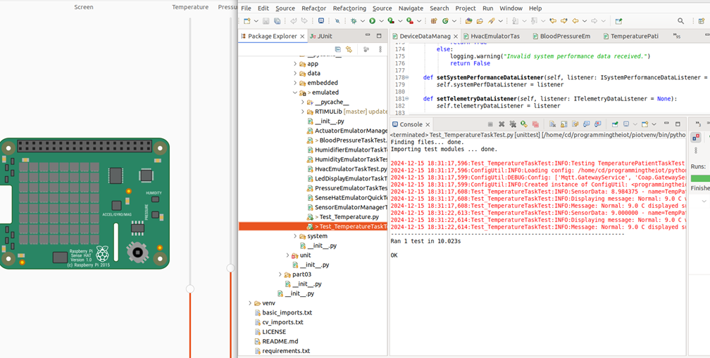
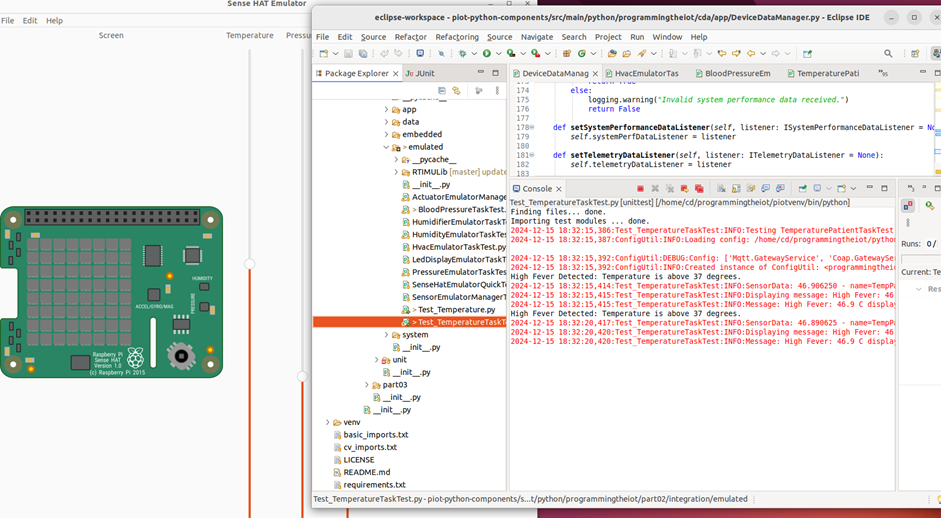
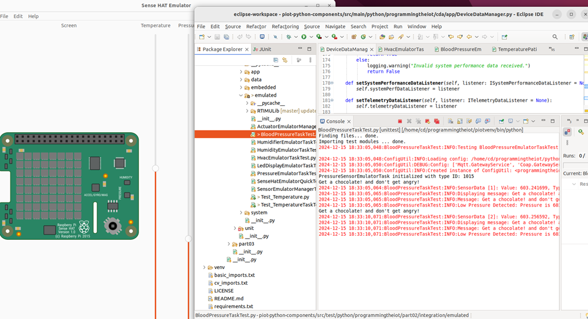
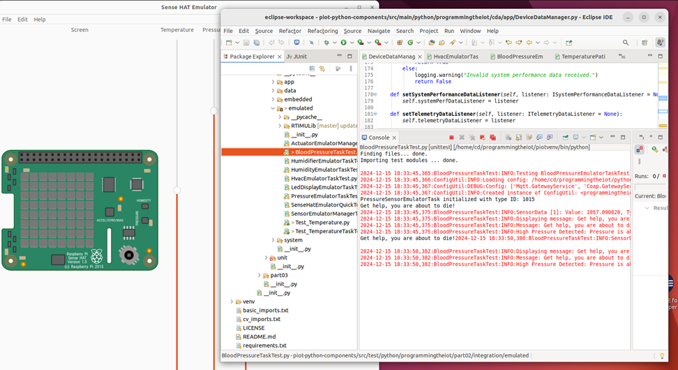

Project Overview

The Patient Monitoring System is designed to provide real-time alerts to patients based on their body temperature and blood pressure levels. 
The system continuously monitors these vital signs and ensures timely notifications to prevent critical health conditions.

Functional Description

The system monitors two vital parameters:

Body Temperature:

 	Alerts the patient when the temperature exceeds 37°C (indicating fever or hyperthermia).
 	Alerts the patient when the temperature drops below 37°C (indicating potential hypothermia).

Blood Pressure:

 	Alerts the patient when blood pressure readings exceed 850 mmHg (hypertension warning).
 	Alerts the patient when blood pressure readings drop below 850 mmHg (hypotension warning).

System Components

Sensors
 	Temperature Sensor: Accurately measures the patient’s body temperature in real-time.
 	Blood Pressure Monitor: Detects systolic and diastolic blood pressure.
Alert Mechanism
 	Visual Alerts: LEDs or screen notifications to indicate abnormal readings.
 	Audio Alerts: Buzzer or speaker to notify the patient immediately.
 	Communication Alerts: Option to send notifications via SMS or app to the patient’s smartphone.

Screenshot 1: Is showing when temperature is normal

 
 Screenshot 2: Is showing when the temperature is high
 
Screenshot 3: Is showing when blood pressure is normal 
 
Screenshot 4: Is showing when blood pressure is high
 

Conclusion 
The Patient Monitoring System was developed with the goal of providing real-time alerts to patients based on critical health parameters, such as body temperature and blood pressure. This system monitors vital signs continuously and issues timely notifications to help prevent critical health conditions.  
However, during the development process, we identified a key area for improvement. Currently, the system interfaces directly with specific sensors for monitoring these parameters. This direct coupling limits the modularity and scalability of the design. A efficient approach would have been to utilize a handler mechanism. By employing a handler, we could have decoupled the sensor inputs from the actuation logic, improving flexibility, reusability, and integration in CDA.  

